[MIT License](LICENSE) · Open-source application code · [Third-party asset notices](docs/media-attribution.md)

# Veyframe

**Turn a working website into a story worth watching.**

Product launches move faster than video production. Marketing teams still spend time learning
a workflow, writing a script, recording clean takes, adding voiceover, aligning captions, and
assembling footage into a shareable video. A small product change can send them through the loop again.

Veyframe brings those steps into one application: provide a website URL and a creative brief,
choose a format, and follow a generation job through research, script direction, browser capture,
narration, and rendering. Review the finished video in your project library and download an MP4.

Built for the **Google Cloud Agentic Cinema Hackathon, Parallel track**, Veyframe applies agentic
AI to the repetitive parts of a real marketing workflow. Gemini and Google ADK direct the story;
Parallel retrieves supporting product context; real browser recordings keep the product visible.
The goal is less production work—not replacing product footage with invented screens.

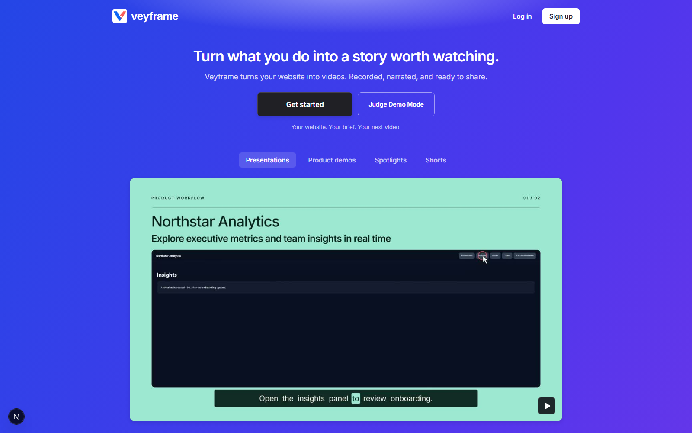

## Hosted demo

**[Open Veyframe](https://veyframe-web-5zo4cenn3q-uc.a.run.app/)** → **Judge Demo Mode**.

No personal account or API key is needed for the hosted judge entry. Cloud Run scales to zero,
so the first visit may take a little longer. Public playback examples are also available directly
on the landing page: select a format, then **Watch with sound**.

## Judge demo testing — Wikipedia

### 1. Inspect an existing result

Enter **Judge Demo Mode** to open **Projects**. Open an available completed example, play it with
sound, seek through the recording, and try **Download MP4**. Playing a saved export does not start
another generation. The judge workspace contains shared demonstration data: please do not delete
existing examples or enter private information.

### 2. Generate a new presentation

Open **Studio** and enter:

| Field | Test input |
| --- | --- |
| Demo title | `Wikipedia — presentation test` |
| Website URL | `https://www.wikipedia.org/` |
| Demo format | **Presentation Demo** |
| Target Audience | **Product leaders** |
| Voice & Tone | **Professional & confident** |
| Length | **~2 minutes · up to 2:20** |
| Call to Action | `Explore Wikipedia` |
| Captions / Smooth zoom | Leave enabled |
| Output format | Landscape / 1440p |
| Preview first five slides | Leave unchecked for the full presentation |

Paste this into **Describe your video**:

> Introduce Wikipedia to a first-time reader. Search for Solar System, explore the article's
> Formation and evolution and General characteristics sections, then follow the Earth link.
> Show visible mouse movement and clicks, smooth zooms, clear narration, and highlighted captions.
> End with Explore Wikipedia.

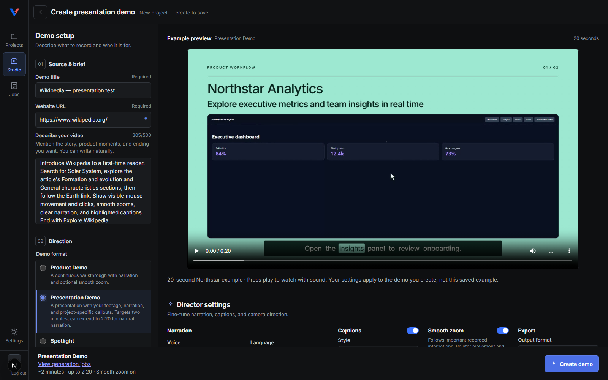

The Studio preview is a saved **Roamstead example**, not your newly generated Wikipedia video.
Click **Create demo** to submit the brief. New generation uses the configured live Google and
Parallel services and consumes API quota.

### 3. Follow the job and inspect the output

You are taken to **Jobs** with the new job selected. Check the current stage, timestamped updates,
heartbeat, completed work, and estimated remaining time. Only **one generation per account** can
be active at once. If one is already running, inspect it rather than submitting duplicates.

Allow several minutes; presentation tests have taken tens of minutes, especially with retries.
Video duration is not generation time. Follow Jobs rather than assuming a motionless preview is
the new output. If the job fails, inspect its error before approving a retry.

When it finishes, open **Play finished demo** or find your title in **Projects**. Verify:

- Wikipedia footage loads and the search, article navigation, and Earth link are visible.
- Pointer movement and click feedback appear; enabled zooms ease in and out.
- Narration is audible, captions highlight words, and no placeholder footage replaces the recording.
- The presentation targets two minutes, with up to twenty seconds of narration flexibility.
- The downloaded MP4 plays independently of the browser.
- **Sources**, on the editor's right-hand rail, exposes saved research and available generation
  activity. Source-to-scene links require the matching approved storyboard; older or direct
  pipeline examples may not have a complete job trace. Retrieved sources are not automatically
  claims used in narration.

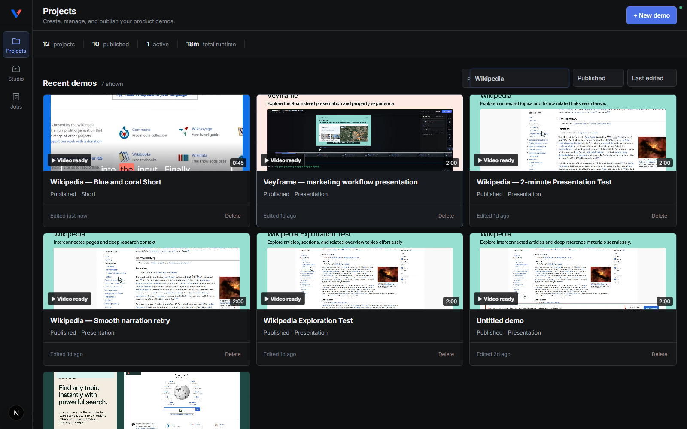

For a shorter live test, choose **Spotlight** (30 seconds) with a brief focused on searching
Wikipedia. To test the portrait layout, choose **Short** (45 seconds) and vertical output.
Run these separately, after the current job finishes. Each format is a separate generation,
not an automatic batch conversion of the presentation.

## See the output

The screenshots below were captured from the running local application. The animations are
shortened, silent excerpts of real exports—not mockups. The hosted version follows the last
successful deployment and may not yet include every local UI change.

### Continuous Product Demo

An uninterrupted walkthrough with narration, visible pointer interactions, captions, and optional
smooth zoom. This one-minute export uses the Roamstead property-search application and a continuous
browser recording with visible clicks, narration, captions, and smooth zoom.

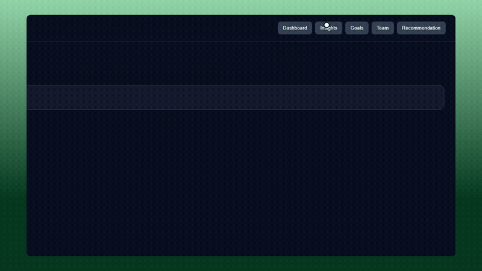

[Full one-minute Roamstead Product Demo with audio](apps/web/public/examples/roamstead-product-60s.mp4)

### Presentation, Spotlight, and Short

| Format | Purpose | Output |
| --- | --- | --- |
| Presentation Demo | A slide-by-slide product story using reusable layouts and actual recordings | Approximately 2 minutes; up to 2:20 |
| Spotlight | Demonstrate one feature and its benefit | 30 seconds |
| Short | Introduce connected capabilities in a concise story | 45 seconds; landscape or portrait |

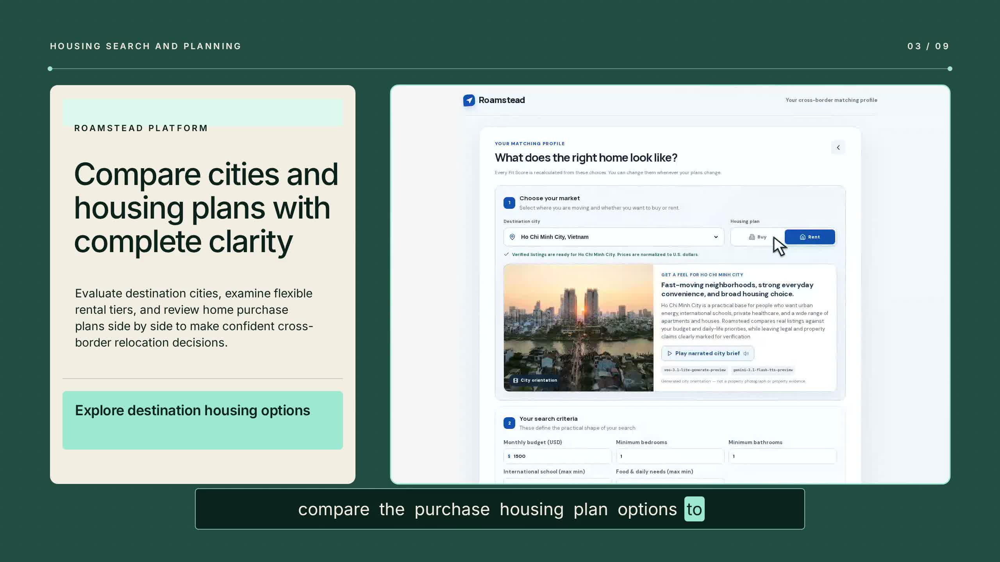

[Roamstead Presentation Demo with audio](apps/web/public/examples/roamstead-presentation-120s.mp4) ·
[Spotlight example with audio](apps/web/public/landing/spotlight-example.mp4)

<p align="center">
  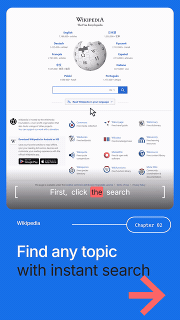
</p>

[Full 45-second Roamstead Short with audio](apps/web/public/examples/roamstead-short-45s.mp4)

### Review and delivery

Finished videos stay in Projects. The editor provides playback, download, and format-dependent
controls for layout and camera review. YouTube upload is optional and requires a separately
configured Google OAuth connection; **Download MP4** does not require YouTube authorization.

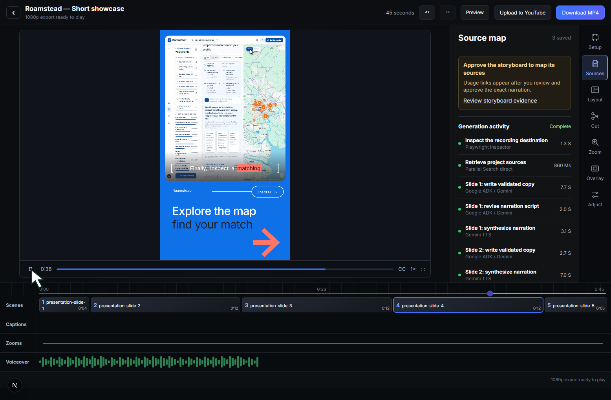

## Workflow benchmark

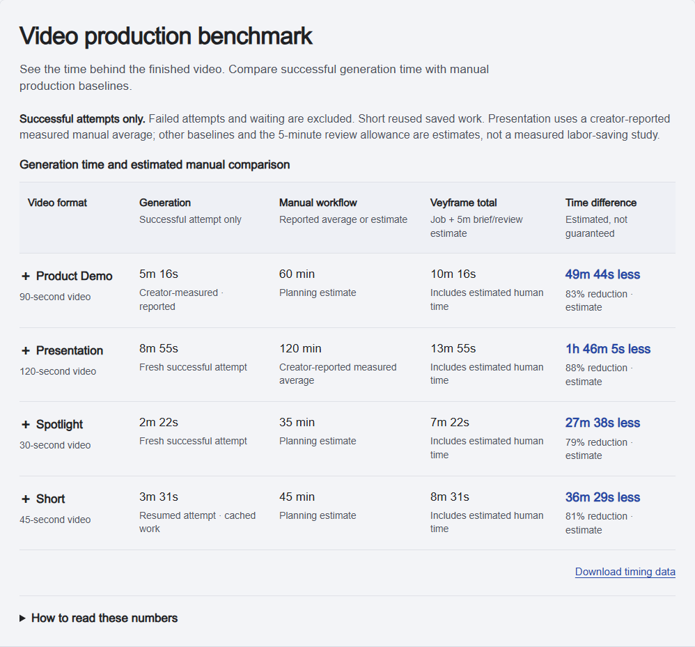

The table measures **successful attempt duration only** for three selected local jobs:
Presentation **8m55s**, Spotlight **2m22s**, and Short **3m31s** (a resumed attempt using saved work; failed processing and retry waiting excluded). The old Presentation figure included two later successful rebuilds
and completed-state gaps; these are now excluded. Product Demo remains a **creator-measured
5m16s**, without a matched timestamped job.

With an estimated five minutes for brief/review, Presentation totals **13m55s**, approximately
**88% less elapsed time** than the creator-reported measured manual average of 120 minutes.
Other manual baselines and all stage allocations are estimates. Manual sample size and timing
records are not provided here. These selected runs are not a controlled comparison or speed guarantee.

[Download timing data and methodology](apps/web/public/benchmarks/generation-2026-09-06.json).

## Runtime technology and evidence

| Technology | What it does in Veyframe | Code |
| --- | --- | --- |
| Parallel Search | Searches for product context; saves URLs, titles, excerpts, and request receipts | [Official SDK import and actual Search call](services/api/src/demodirector_api/parallel_search.py#L13) |
| Gemini + Google ADK | Reads evidence and planned interactions, then creates typed slide copy and narration scripts | [ADK slide director](services/api/src/demodirector_api/presentation_pilot.py#L267) |
| Gemini TTS | Synthesizes continuous narration, with timing validation and a rate-limit fallback | [Narration adapter](services/worker/src/demodirector_worker/narration.py#L65) |
| Playwright | Records real browser actions, including pointer and click feedback | [Authored capture and composition](services/worker/src/demodirector_worker/presentation_assets.py) |
| FFmpeg | Composes recordings, templates, captions, audio, and final exports deterministically | [Renderer](services/worker/src/demodirector_worker/renderer.py) |
| Google Cloud Run, Tasks, Firestore, Storage | Hosts the app, schedules durable work, and persists metadata and media | [Cloud setup](docs/cloud-deployment.md) |

### Parallel is called at runtime

The backend installs `parallel-web`, imports its client, and makes a real Search API request:

```python
from parallel import Parallel

# Inside ParallelSearchAdapter.__init__:
self._client = client or cast(ParallelSDKClient, Parallel(api_key=settings.api_key))

# Inside ParallelSearchAdapter.search:
response = self._client.search(
    objective=objective,
    search_queries=list(queries),
    mode=self.mode,
    max_chars_total=MAX_CHARS_TOTAL,
    advanced_settings={
        "max_results": MAX_RESULTS,
        "source_policy": {"include_domains": [domain]},
    },
)
```

This is an excerpt, not a standalone script. See the
[complete adapter](services/api/src/demodirector_api/parallel_search.py#L97) and
[generation call site](services/api/src/demodirector_api/presentation_pipeline.py#L227).
Results are normalized into typed `ResearchSource` records and supplied to the ADK director.
Resumed jobs may reuse saved research. Zero results, provider errors, retrieved sources, and
cited sources are tracked separately; Veyframe does not fabricate successful research.
See [Parallel research behavior](docs/parallel-research.md).

Model output is validated before it affects execution. Browser actions use bounded, typed
instructions; the runtime does not execute model-generated shell commands or arbitrary browser
JavaScript. AI/agent behavior uses Google Gemini and Google ADK, with Parallel as the direct
partner Search integration. ADK runs inside the API; this deployment does not claim Agent Engine.

## Runtime architecture

### Project overview

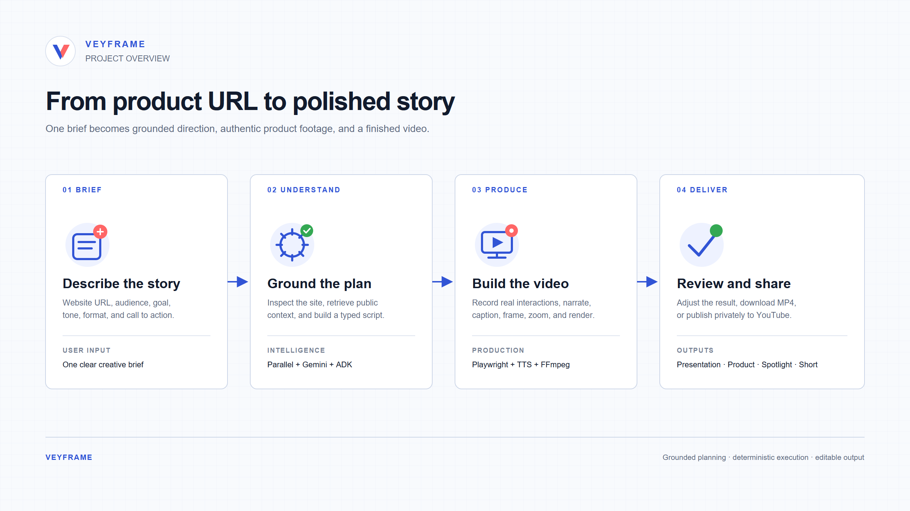

### Google Cloud architecture

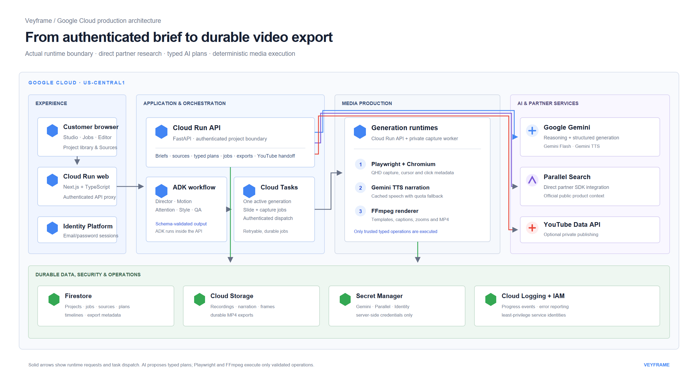

### Agent workflow

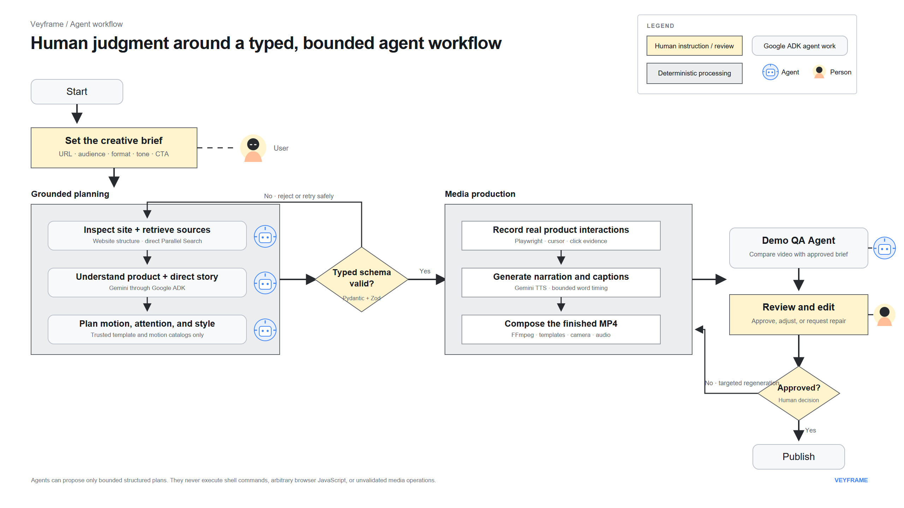

[Editable architecture diagrams](architecture/README.md) ·
[Durable generation jobs](docs/generation-jobs.md) ·
[Cloud Run deployment and CI/CD](docs/cloud-deployment.md)

## Local setup

Requirements: **Node.js 20.9+**, **Python 3.12+**, **FFmpeg and ffprobe** on your PATH, and
Chromium installed through Playwright. Live generation needs Google Gemini and Parallel credentials.

```bash
git clone https://github.com/GreatEx750/Veyframe.git
cd Veyframe
npm ci
python -m venv .venv
```

Activate the virtual environment:

```powershell
# Windows PowerShell
.venv\Scripts\Activate.ps1
```

```bash
# macOS / Linux
source .venv/bin/activate
```

Then install the backend and browser:

```bash
python -m pip install -r requirements-dev.txt
python -m playwright install chromium
```

On Linux, use `python -m playwright install --with-deps chromium` if browser system libraries
are missing. Copy [.env.example](.env.example) to `.env`; fill in `GEMINI_API_KEY` and
`PARALLEL_API_KEY` for live generation. Keep the supplied local SQLite settings for local testing.
Never commit `.env`, OAuth secrets, service-account keys, or saved browser authentication state.

## Development

```bash
npm run dev
```

This starts the web app at [localhost:3000](http://localhost:3000), API at
[localhost:8000](http://localhost:8000), and local generation worker. Keep all three running.
If starting web and API separately, also run `npm run dev:worker`; otherwise jobs may remain queued.

Hosted authentication uses Google Identity Platform and HTTP-only application sessions.
Hosted secrets are supplied through Secret Manager, not bundled into the frontend.
For OAuth setup and its testing restrictions, see [YouTube configuration](docs/youtube-local-upload.md).

## Quality checks

```bash
npm test
npm run lint
npm run typecheck
npm run compliance
```

Ordinary automated tests use test doubles rather than paid AI calls. Live checks require explicit
provider configuration; see the [smoke-test checklist](docs/live-smoke-checklist.md).
Passing unit tests does not prove a fresh cloud generation has completed.

## Repository layout

| Path | Contents |
| --- | --- |
| `apps/web` | Next.js UI, API proxy routes, public example media |
| `services/api` | FastAPI, authentication, research, ADK orchestration, generation jobs |
| `services/worker` | Capture, narration, camera, templates, media rendering |
| `packages/contracts` | Shared typed Python and TypeScript schemas |
| `tests`, `test_support` | End-to-end checks and deterministic test support |
| `scripts` | Reproducible development, verification, and asset tools |
| `architecture`, `docs` | Diagrams, walkthrough images, setup, and verification notes |

The internal package namespace remains `demodirector` for compatibility; the product is Veyframe.
Generated job recordings, databases, temporary files, private build notes, and credentials are
ignored. Required public media, templates, font licenses, and the small judge fixture stay tracked
so a fresh clone can build without private local artifacts.

## Current limitations

- The recommended repeatable test target is Wikipedia. Other sites can fail because of CAPTCHA,
  authentication, changed selectors, slow loading, or unavailable resources. Veyframe does not bypass CAPTCHA.
- Generation depends on provider latency and quota. Duration targets can require narration retries.
- A saved example is not evidence of a new live API call; check the job's own research/activity records.
- YouTube authorization and upload are separate from MP4 generation; Google OAuth testing-mode
  restrictions can prevent an unapproved account from connecting.
- These examples demonstrate separate format generation, not instant repurposing of one recording.

## License and media attribution

Application code is available under the root [MIT License](LICENSE). Third-party fonts,
website content, trademarks, and other assets retain their respective licenses and ownership.
Wikipedia is a test subject, not a sponsor or endorsement. See
[asset provenance and attribution](docs/media-attribution.md) before redistributing example footage.
